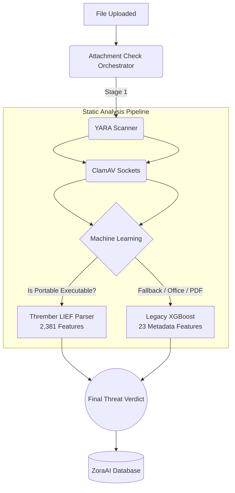

# ZoraAI Attachment Check

The **Attachment Check** module is a fast, multi-layered static malware analysis engine built for the ZoraAI ecosystem. It processes unknown documents and executables (.exe, .pdf, .docx, etc.) by aggressively pushing them through a unified heuristic and machine-learning anomaly detection pipeline.

## Core Architecture

The static engine operates completely in-memory without detonating the payload, making it extremely fast. 

It executes a **3-Stage Unified Pipeline (`pipeline.py`)**.
1. **YARA Heuristics (Ruleset):** Fast string/byte matching.
2. **ClamAV Endpoint (Signatures):** Deep hash scanning via socket.
3. **EMBER Machine Learning (Anomaly):** Mathematical risk scoring against XGBoost/LightGBM.

### Architecture Diagram



---

## Technical Details (`app/static_analysis/`)

1. **YARA Heuristics (`yara_scanner.py`)**:
   Locates specific string signatures inside the payload. 
   *Examples: Unpacking Base64 executables, locating Ransomware demand strings, hooking into memory injection API lists.*
   
2. **ClamAV Endpoint (`clamav_scanner.py`)**:
   Streams the file bytes directly to a connected ClamAV daemon (`clamd`) via Unix/Network sockets to bounce the file against millions of known, historically malicious file hashes.

3. **EMBER Machine Learning (`classifier.py`)**:
   Routes the file based on its MIME type:
   - **PE Files (.exe, .dll)**: Feeds instantly into the **Thrember LightGBM Model**, which translates the byte distribution, PE section entropy, and imports into a mathematically dense 2,381-dimensional vector, scoring it between 0-100% risk.
   - **Other Files (.pdf, Macros)**: Parsed manually for JavaScript/Macro abuse and routed to a fallback XGBoost model trained on custom ZoraAI datasets.

---

## Getting Started

### Prerequisites
- Python 3.10+
- `yara-python` and `clamd` (via `pip`)
- `polars`, `lief`, `lightgbm`, `signify` (via `pip` for Thrember ML model)
- A running instance of ClamAV (default `localhost:3310`).

### Running the End-to-End Pipeline
Use the built-in test scripts to verify the integrity of the environment across all 3 scanning layers:

```bash
# Test the unified YARA -> ClamAV -> Thrember Static Pipeline
cd app/attachment-check/tests/
python test_pipeline.py
```

### Training the Fallback XGBoost Model
If you need to re-train the legacy static model, download the EMBER parquet datasets and run:
```bash
python -m app.training.train_static_classifier
```
